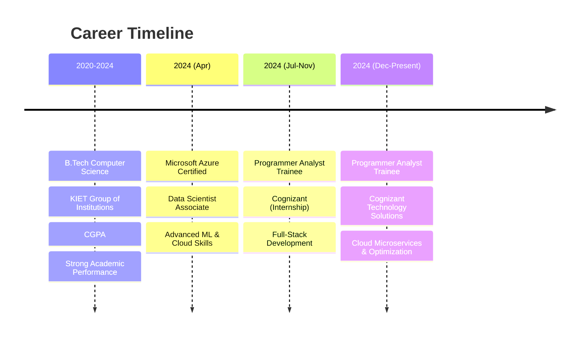

# 🌟 Vishal Panwar

<div align="center">
  


</div>

<div align="center">
  
</div>

---

## 🎯 About Me


```javascript
const vishal = {
    role: "Software Engineer & AI Enthusiast",
    location: "India 🇮🇳",
    company: "Cognizant Technology Solutions",
    education: "B.Tech Computer Science (2024)",
    certifications: ["Microsoft Azure Data Scientist"],
    passion: ["AI/ML", "Cloud Architecture", "Full-Stack Dev"],
    currentFocus: "Building AI-powered scalable solutions",
    funFact: "I debug faster with coffee ☕"
};
```

<br clear="right"/>

> 💡 **Mission**: Transforming ideas into intelligent, scalable digital solutions that make a real-world impact.

---

## 🚀 Tech Arsenal

<div align="center">

### 🎨 Frontend Mastery


### ⚡ Backend Powerhouse


### 🗄️ Database Expertise


### ☁️ Cloud & DevOps


### 🤖 AI/ML Stack


</div>

---

## 🏆 Featured Projects

<div align="center">

<table>
<tr>
<td width="50%">

### 🍽️ Table Tap
**Smart Food Ordering Platform**

```typescript
const features = {
  tech: ["React", "MERN", "Firebase", "LLM"],
  deployment: "Multi-cloud (AWS + Azure)",
  ai: "Restaurant manager assistance",
  realtime: "Order tracking & updates"
}
```

🌟 **Highlights:**
- Contactless ordering system
- Real-time order tracking
- AI-powered restaurant insights
- 99.9% uptime with cloud scaling

[](#)
[](#)

</td>
<td width="50%">

### 🏠 PG Flow
**Complete PG Management Solution**

```dart
class PGFlow {
  String platform = "Flutter (Cross-platform)";
  List<String> features = [
    "Resident Management",
    "Payment Tracking", 
    "Growth Analytics",
    "Real-time Notifications"
  ];
}
```

🌟 **Highlights:**
- Cross-platform mobile app
- Comprehensive PG operations
- Advanced analytics dashboard
- 10,000+ potential users

[](#)
[](#)

</td>
</tr>
<tr>
<td width="50%">

### 🅿️ Smart Parking System
**AI-Powered Parking Detection**

```python
model_performance = {
    "accuracy": "95%+",
    "technology": "YOLOv8 + OpenCV",
    "capacity": "100+ concurrent streams",
    "real_time": True
}
```

🌟 **Highlights:**
- Computer Vision with YOLOv8
- Real-time spot detection
- Scalable architecture
- Smart city integration ready

[](#)

</td>
<td width="50%">

### 🤖 AI/ML Projects
**Intelligent Data Solutions**

```python
projects = {
    "predictive_analytics": "scikit-learn + MLflow",
    "data_pipelines": "Apache Airflow + Azure",
    "llm_integration": "OpenAI API + Custom RAG",
    "computer_vision": "YOLO + TensorFlow"
}
```

🌟 **Highlights:**
- Advanced ML pipelines
- Automated data processing
- Custom LLM implementations
- Production-ready solutions

[](#)

</td>
</tr>
</table>

</div>

---

## 💼 Professional Journey

<div align="center">



</div>

**🎯 Current Role Highlights:**
- Developing cloud-native microservices for enterprise clients
- Optimizing database performance with advanced SQL techniques  
- Building scalable internal tools for improved delivery workflows
- Collaborating on AI-powered automation solutions

---

## 📊 GitHub Analytics

<div align="center">
  


<br/>


<br/>


</div>

---

## 🏅 Achievements & Recognition

<div align="center">

| 🎖️ Certification | 📅 Date | 🏢 Organization |
|:---|:---:|:---:|
| **Azure Data Scientist Associate** | Apr 2024 | Microsoft |
| **HackMol 4.0 Finalist** | Feb 2023 | NIT Jalandhar |
| **Full Stack Development** | 2024 | Multiple Platforms |

</div>

---

## 📡 Connect & Collaborate

<div align="center">
  
[](https://vishalpanwar.vercel.app)
[](https://linkedin.com/in/vishalpanwar416)
[](https://github.com/vishalpanwar416)
[](mailto:vishalpanwar416@gmail.com)
[](https://leetcode.com/vishalpanwar416)
[](#)

</div>

---

<div align="center">

### 🚀 Open for Collaboration

**Looking to collaborate on:**
- 🤖 AI/ML Projects & Research  
- ☁️ Cloud-Native Applications
- 🔗 Full-Stack Development
- 📱 Mobile App Development
- 🌍 Open Source Contributions

---


*"Innovation distinguishes between a leader and a follower."* - Steve Jobs

**⭐ If you find my work interesting, consider giving it a star!**

</div>
